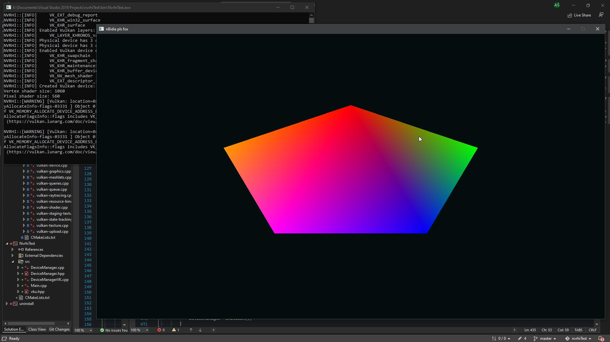
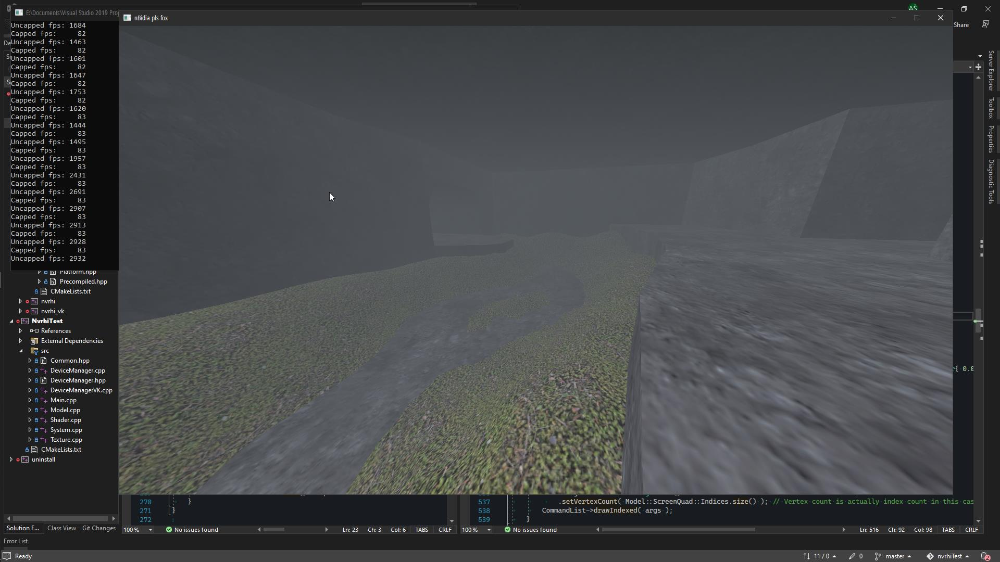

My experiments with [NVRHI](https://github.com/NVIDIAGameWorks/nvrhi), a rendering abstraction & convenience library for DirectX 11, 12 and Vulkan.

If you're trying to get started with NVRHI and the [Donut examples](https://github.com/NVIDIAGameWorks/donut_examples) are too overwhelming, this ain't a bad place to start! I'd also recommend looking at [hello_nvrhi](https://github.com/Aeva/hello_nvrhi) if you need an even more barebones example.

--------------

I started doing OpenGL stuff in late 2019 and by late 2021, I got bored of OpenGL, I wanted to use something newer. Learning one of these new APIs raw seemed pretty scary to me, so after a while of trying out BGFX, DiligentCore, Vookoo and others, a fella told me to try out NVRHI.

That happened roughly in April or May 2022, and it looked like this:

(you may find remnants of this wonderful little pentagon in the code)

Right now it looks like this:

We got glTF loading, texture loading with stb_image, and some basic exponential fog. ^w^

Functionality todo:
* handle resizing windows
* handle fullscreen
* test on my 2012 Linux laptop

Experimentation todo:
* load a BSP for benchmarking
* mesh-based fog
* skeletal animation

Cleanup todo:
* separate stuff more (Common.hpp seems to cause slow compile times)
* simplify CMakeLists for this thing

Once some more things are done, I'll be using NVRHI as a render backend for [my engine](https://github.com/Admer456/btx-engine).
